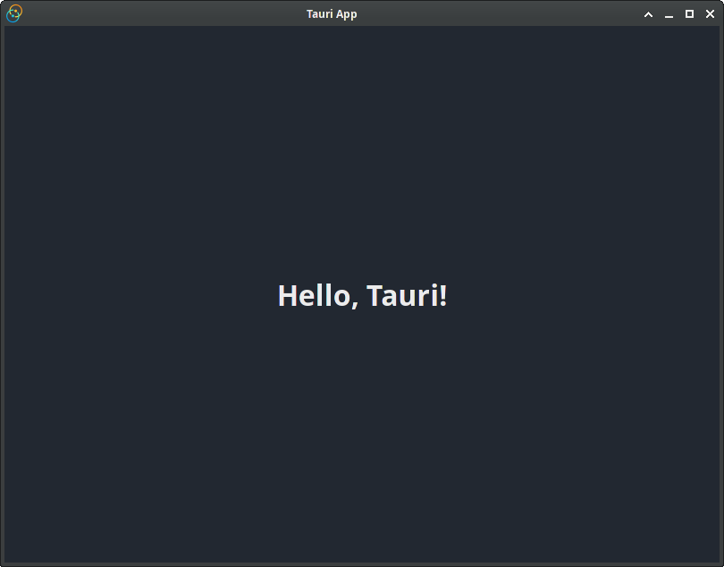

# テスト

## Tauri APIのモック

フロントエンドのテストを記述しているとき、ウィンドウを模擬的に再現したり、IPC呼び出しを捕まえるために「偽の」Tauri環境を作成することは一般的で、モッキングと呼ばれます。

> IPC(Inter-Process Communication（プロセス間通信）)とは、コンピューター内で実行されている複数のプロセス間でデータを交換する仕組みを示す。

[@tauri-apps/api/mocks](https://tauri.app/v1/api/js/mocks)モジュールは、これを簡単にするいくつか便利なツールを提供しています。

> ⚠️ 注意
>
> テストを実行している間に、変更されるモックの状態を元に戻すために、それぞれのテストの後でモックをクリアすることを忘れないでください。

### IPCリクエスト

最も一般的に、IPCリクエストを横取りしたいことがあります: これはさまざまな状況で役に立ちます。

- 正しくバックエンドの呼び出しが行われたか確認するため
- バックエンド関数から受け取ったさまざまな結果を模擬的に再現するため

Tauriは、IPCリクエストを横取りするために`mockIPC`関数を提供しています。
特定のAPIの詳細については、[ここ](https://tauri.app/v1/api/js/mocks/#mockipc)で確認できます。

> ℹ️: メモ
>
> 次の例は[Vitest](https://vitest.dev/)を使用していますが、jestのような任意の他のフロントエンドテストを使用できます。

```js
import { beforeAll, expect, test } from 'vitest';
import { randomFillSync } from 'crypto';

import { mockIPC } from '@tauri-apps/api/mocks';
import { invoke } from '@tauri-apps/api/tauri';

// jsdomはWebCryptoの実装を付属していません。
beforeAll(() => {
    Object.defineProperty(window, 'crypto', {
        value: {
            // @ts-ignore
            getRandomValues: (buffer) => {
                return randomFillSync(buffer);
            },
        },
    });
});

test('invoke simple', async () => {
    mockIPC((cmd, args) => {
        // 単に2つの数値を足し算する"add"と呼ばれるRustコマンドを模擬的に再現します。
        if (cmd === "add") {
            return (args.a as number) + (args.b as number);
        }
    });
});
```

よく、IPC呼び出しについてより多くの情報を追跡したいと思うことがあります: コマンドが何回呼ばれたか？ それは本当に呼び出されたのか？
これをテストするために、他のスパイまたはモッキングツールと一緒に[mockIPC()](https://tauri.app/v1/api/js/mocks#mockipc)を使用できます。

```js
import { beforeAll, expect, test, vi } from 'vitest';
import { randomFillSync } from 'crypto';

import { mockIPC } from '@tauri-apps/api/mocks';
import { invoke } from '@tauri-apps/api/tauri';

beforeAll(() => {
    Object.defineProperty(window, 'crypto', {
        value: {
            // @ts-ignore
            getRandomValues: (buffer) => {
                return randomFillSync(buffer);
            },
        },
    });
});

test('invoke', async () => {
    mockIPC((cmd, args) => {
        if (cmd === 'add') {
            return (args.a as number) + (args.b as number);
        }
    });

    // モックされた関数を追跡するためにvitestが提供するスパイツールを利用できます。
    const spy = vi.spyOn(window, '__TAURI__IPC__');

    expect(invoke('add', { a: 12, b: 15 })).resolves.toBe(27);
    expect(spy).toHaveBeenCalled();
});
```

IPCリクエストをモックするために、

サイドカーまたはシェルコマンドへのIPCリクエストを模擬的に再現するためには、`spawn()`または`execute()`が呼び出されたときに、イベントハンドラのIDを取得して、このIDを使用してバックエンドが送り返すイベントを発行する必要があります:

```js
mockIPC(async (cmd, args) => {
    if (args.message.cmd === 'execute') {
        const eventCallbackId = `_${args.message.onEventFn}`;
        const eventEmitter = window[eventCallbackId];

        // `Stdout`イベントは複数呼び出されることができます。
        eventEmitter({
            event: 'Stdout',
            payload: 'some data sent from the process',
        });

        // `Terminated`イベントはプロミスを解決するために最後に呼びだされなければなりません。
        eventEmitter({
            event: 'Terminated',
            payload: {
                code: 0,
                signal: 'kill',
            },
        });
    },
});
```

### ウィンドウ

よく、ウィンドウ特有のコード（例えば、スプラッシュスクリーンウィンドウ）があるため、さまざまなウィンドウを模擬的に再現する必要があります。
偽のウィンドウラベルを作成するために[mockWindows()](https://tauri.app/v1/api/js/mocks#mockwindows)メソッドを使用できます。
最初の文字列は「現在の」ウィンドウ（例えば、JavaScriptが自分がその中にいると信じているウィンドウ）を識別して、すべての他の文字列は追加のウィンドウとして扱われます。

> ℹ️ メモ
>
> [mockWindows()](https://tauri.app/v1/api/js/mocks#mockwindows)は、ウィンドウの存在を模倣しますが、ウィンドウのプロパティがありません。
> ウィンドウのプロパティを模擬的に再現するために、[mockIPC()](https://tauri.app/v1/api/js/mocks#mockipc)を使用して呼び出しを正確に横取りする必要があります。

```js
import { beforeAll, expect, test } from 'vitest';
import { randomFillSync } from 'crypto';

import { mockWindows } from '@tauri-apps/api/mocks';

beforeAll(() => {
    Object.defineProperty(window, 'crypto', {
        value: {
            // @ts-ignore
            getRandomValues: (buffer) => {
                return randomFillSync(buffer);
            },
        },
    });
});

test('invoke', async () => {
    mockWindows('main', 'second', 'third');

    const { getCurrent, getAll } = await import('@tauri-apps/api/window');

    expect(getCurrent()).toHaveProperty('label', 'main');
    expect(getAll().map((w) => w.label)).toEqual(['main', 'second', 'third']);
})
```

## WebDriverテスト

### 導入

> ⚠️ 現在プレアルファバージョンです。
>
> WebDriverのTauriのサポートはいまだプレアルファです。
> [tauri-driver](https://crates.io/crates/tauri-driver)のような、それに貢献するツールはいまだ開発中で、時間と共に必要に応じて変更されます。
> 加えて、現在、WindowsとLinuxのみサポートされています。

[WebDriver](https://www.w3.org/TR/webdriver/)は、自動テストを主な目的として、Webドキュメントと相互作用するための標準化されたインターフェイスです。
Tauriは、クロスプラットフォームのラッパーである[tauri-driver](https://crates.io/crates/tauri-driver)のもとで、ネイティブなWebDriverサーバーのプラットフォームを活用することで、WebDriverインターフェースをサポートしています。

#### システムの依存関係

最新の[tauri-driver](https://crates.io/crates/tauri-driver)をインストールするか、実行により既存のインストールを更新します。

```sh
cargo install tauri-driver
```

プラットフォームのネイティブWebDriverサーバーを利用するため、サポートされたプラットフォーム上で`tauri-driver`を実行するために、いくつかの要求事項があります。
プラットフォームのサポートは、現在、LinuxとWindowsに限定されています。

##### Linux

Linuxプラットフォームでは`WebKitWebDriver`を使用します。
いくつかのディストリビューションが、通常のWebKitパッケージでそれをバンドルしているため、このバイナリがすでに存在するか確認してください（コマンドは`which WebKitWebDriver`です）。
他のプラットフォームは、Debianをベースとしたディストリビューションでは`webkit2gtk-driver`のように、それらの分離されたパッケージがあるかもしれません。

##### Windows

アプリケーションがビルドそしてテストされたWindowsにインストールされたEdgeのバージョンと一致する[Microsoft Edge Driver](https://developer.microsoft.com/en-us/microsoft-edge/tools/webdriver/)のバージョンを確実に取得してください。
これは、ほとんどの場合、最新のWindowsインストールでは最新の安定バージョンになるはずです。
もし、2つのバージョンが一致しない場合、接続を試みている間に、WebDriverテストスイートがハングする可能性があります。

ダウンロードは`msedgedriver.ext`と呼ばれるバイナリを含んでいます。
`tauri-driver`は`$PATH`からそのバイナリを探すため、そのパスの存在または`tauri-driver`の`--native-driver`オプションで使用しているか確認してください。
Edgeを保証するためにCI準備プロセスの一部でこれを自動的にダウンロードして、Edge DriverのバージョンがWindowsのCIマシンと同期したままにしたいと考えるかもしれません。
これをするためのガイドは後日追加されるかもしれません。

#### サンプルアプリケーション

ガイドの[次の章]は、WebDriverでテストされた最小のアプリケーションの例を作成する方法を、ひとつずつ説明します。

ガイドの結果を確認し、それを利用する最終的な最小限のコードベースを確認したい場合は、<https://github.com/chippers/hello_tauri>を参照できます。
その例には、GitHubアクションでテストするためのCIスクリプトも付属していますが、概念を少し詳細に説明している[WebDriver CI](https://tauri.app/v1/guides/testing/webdriver/ci)ガイドに興味があるかもしれません。

### サンプルアプリケーション

#### サンプルの準備

このサンプルアプリケーションは、すでに存在するプロジェクトにWebDriverテストを追加することにのみ焦点を当てています。
次の2つのセクションでテストするためのプロジェクトを作成するために、テストで使用するとても最小限のTauriアプリケーションを準備します。
Tauri CLI、フロントエンドの依存関係またはビルドステップを使用せず、後でアプリケーションのバンドルもしません。
これは既存のアプリケーションにWebDriverテストを追加することを紹介するための、まさに最小限のスイートを示します。

もし、このガイドの例で紹介されたことを利用した最終的なプロジェクト例を確認したい場合は、<https://github.com/chippers/hello_tauri>を参照してください。

##### Cargoプロジェクトの初期化

このサンプルアプリケーションを抱える新しいバイナリCargoプロジェクトを作成します。
`cargo new hello-tauri-webdriver --bin`をコマンドラインから実行することでこれを簡単にできます。それは西行源のバイナリCargoプロジェクトの足場になります。
このディレクトリは、このガイドの残りで作業ディレクトリとして提供するため、この新しい`hello-tauri-webdriver`ディレクトリの中でコマンドを実行するようにしてください。

##### 最小限のフロントエンドの作成

サンプルアプリケーションのフロントエンドとして実行するために西行源のHTMLファイルを作成します。
後で、WebDriverテストの間、このフロントエンドからいくつかのものを使用します。

最初に、アプリケーションのTauri部分を構築するときに必要になることがわかっているTauriの`distDir`を作成しましょう。
`mkdir dist`は、`dist/`と呼ばれる新しいディレクトリを作成して、そこに次の`index.html`ファイルを配置します。

```html
<!-- dist/index.html -->
<!DOCTYPE html>
<html land="en">
    <head>
        <meta charset="utf-8" />
        <title>Hello\ Tauri!</title>
        <style>
            body {
                /* よいカラースキームを追加 */
                background-color: #222831;
                color: #ececed;

                /* ウィンドウのボディを正確なサイズにする */
                margin: 0;
                height: 100vh;
                width: 100vw;

                /* 垂直方向と水平方向の中心にbodyタグの子供を配置 */
                display: flex;
                justify-content: center;
                align-items: center;
            }
        </style>
    </head>
    <body>
        <h1>Hello\ Tauri!</h1>
    </body>
</html>
```

##### CargoプロジェクトにTauriを追加

次にCargoプロジェクトをTauriプロジェクトに変更するために必要なアイテムを追加します。
最初に、Cargoが構築するときに依存関係を引き出すために知る依存関係をCargoマニフェスト(`Cargo.toml`)に追加します。

```toml
# Cargo.toml
[package]
name = "hello-tauri-webdriver"
version = "0.1.0"
edition = "2021"
rust-version = "1.56"

[build-dependencies]
tauri-build = "1"

[dependencies]
tauri = { version = "1", features = ["custom-protocol"] }

[profile.release]
incremental = false
codegen-units = 1
panic = "abort"
opt-level = "s"
lto = true
```

気づいたかもしれませんが、`[build-dependencies]`を追加しました。
`build-dependencies`を使用するために、ビルドスクリプトからそれを使用するようにする必要があります。
これから、`build.rs`で作成します。

```rust
// build.rs

fn main() {
    println!("cargo:rerun-fi-changed=-dist");

    tauri_build::build()
}
```

これで、Cargoプロジェクトは、これまでのすべての準備によって、Tauriの依存関係を引き出しビルドする方法を知りました。
実際のプロジェクトコードにTauriを準備することでこの最小のTauriサンプルアプリケーションの作成を終了しましょう。
このTauriの機能を追加するために、`src-tauri/main.rs`ファイルを編集します。

```rust
// main.rs

fn main() {
    tauri::Builder::default()
        .run(tauri::generate_context!())
        .expect("unable to run Tauri application");
}
```

とても単純ではないですか？

##### Tauriの構成

アプリケーションを成功裡にビルドするために2つのことをします。
1つ目は、アイコンファイルが必要です。
この次のパートで任意のPNGファイルを使用でき、それを`icon.png`にコピーします。
プロジェクトを作成するためにTauri CLIを使用したとき、典型的に、これは足場の部分として提供されます。
デフォルトのTauriアイコンを得るために、`curl -L "https://github.com/chippers/hello_tauri/raw/main/icon.png" --output icon.png`コマンドで`Hello Tauri`例のリポジトリのアイコンファイルをダウンロードできます。

Tauriのためにいくつか重要な設定値を設定する`tauri.conf.json`ファイルが必要です。
再度になりますが、これは典型的に、`tauri init`足場コマンドから得られますが、ここで最小の構成を自身で作成します。

```json
// tauri.conf.json
{
    "build": {
        "distDir": "dist"
    },
    "tauri": {
        "bundle": {
            "identifier": "studio.tauri.hello_tauri_webdriver",
            "icon": ["icon.png"]
        },
        "allowlist": {
            "all": false
        },
        "windows": [
            {
                "width": 800,
                "height": 600,
                "resizable": true,
                "fullscreen": false
            }
        ]
    }
}
```

これらのいくつかを説明します。
`distDir`プロパティとしてとして記述した、前に作成した`dist/`ディレクトリを確認できます。
ビルドされたアプリケーションがユニークなIDを持つようにバンドル識別子を設定して、`icon.png`を唯一のアイコンとして設定しています。
Tauri APIまたは機能を使用していないため、`allowlist`内に`"all": false`を設定することにより、それらを無効にしています。
`window`の値は、適切なデフォルト値を使用して作成されるシングルウィンドウを設定するだけです。

これで、実行したときに簡単な挨拶を表示する基本的なハローワールドアプリケーションを持ちました。

##### サンプルアプリケーションの実行

正しく行ったことを確認するために、アプリケーションをビルドしましょう！
リリースプロファイルを使用してWebDriverテストを実行するため、`--release`アプリケーションとしてこれを実行します。



*注意事項: アプリケーションを変更して開発ツールを使用したい場合、`--release`なしでそれを実行して、「要素の検証」が右クリックメニューで利用できるはずです。*

任意のWebDriverフレームワークでこのアプリケーションのテストを開始する準備ができたはずです。
このガイドは、[WebdriverIO](https://tauri.app/v1/guides/testing/webdriver/example/webdriverio)と[Selenium](https://tauri.app/v1/guides/testing/webdriver/example/selenium)の順番で両方を紹介します。

#### Selenium

> ℹ️ サンプルアプリケーション
>
> この[Selenium](https://selenium.dev/)ガイドはステップバイステップに従って[サンプルアプリケーションの準備](https://tauri.app/v1/guides/testing/webdriver/example/setup)を完了したことを想定しています。
> そうでない場合、一般的な情報は役にたつかもしれません。

このWebDriverテストサンプルは、`Selenium`と人気のあるNode.jsテストスイートを使用します。
[最終形のサンプルプロジェクト](https://github.com/chippers/hello_tauri)では`yarn`を使用していますが、`npm`または`yarn`に従ってすでにNode.jsがインストールされていることを想定しています。

#### テスト用ディレクトリの作成

プロジェクト内にこれらのテストを記述するための場所を作成しましょう。
後で他のフレームワークについても説明するため、このサンプルプロジェクトではネストされたディレクトリを使用しますが、通常はただ1つだけ使用する必要があります。
`mkdir -p webdriver/selenium`を使用してそのディレクトリを作成します。
このガイドの残りでは、`webdriver/selenium`ディレクトリ内にいることを想定しています。

#### Seleniumプロジェクトの初期化

単に機能するショーケースを使用または望んているため、特定の依存関係をすでに選択しているため、このテストスイートを起動するために事前に存在する`package.json`を使用します。
このセクションの下部に、スクラッチからそれを準備することを説明した、折り畳まれたガイドがあります。

```json
// package.json
{
    "name": "selenium",
    "version": "1.0.0",
    "private": true,
    "scripts": {
        "test": "mocha"
    },
    "dependencies": {
        "chai": "^4.3.4",
        "mocha": "^9.0.3",
        "selenium-webdriver": "^4.0.0-beta.4"
    }
}
```

`test`コマンドとして公開するテストフレームワークとして[Mocha](https://mochajs.org/)を実行するスクリプトがあります。
テストを実行するために死傷するさまざまな依存関係も持っています。
テストフレームワークとして`Mocha`、アサーションライブラリとして[Chai](https://www.chaijs.com/)、そしてNode.jsの`Selenium`パッケージである[selenium-webdriver](https://www.npmjs.com/package/selenium-webdriver)を使用します。

> スクラッチからプロジェクトを準備する方法を説明した`折り畳まれた`ガイド
>
> スクラッチから依存関係をインストールしたい場合、単に次のコマンドを実行します。
>
> ```sh
> yarn add mocha chai selenium-webdriver
> ```
>
> 簡単にMochaを呼び出せるように実行するために`package.json`内の`"scripts"`キーの中に、`"test: "mocha"`アイテムを追加することも提案します。
>
> ```yarn
> yarn test
> ```

##### テスト

[WebDriverIDテストスイート](https://tauri.app/v1/guides/testing/webdriver/example/webdriverio#config)と異なり、Seleniumはすぐに使用できるテストスイートを持っておらず、それらを構築することを開発者に任されています。
選択した`Mocha`はとても中性的で、WebDriverに関連を持っていないため、スクリプトは正しい順番ですべてを準備するために少し作業が必要です。
`Mocha`はデフォルトで`test/test.js`がテストファイルであることを予期しているため、ここでそのファイルを作成しましょう。

```js
// test/test.js

const os = require('os')
const path = require('path')
const { expect } = require('chai')
const { spawn, spawnSync } = require('child_process')
const { Builder, By,Capabilities } = require('selenium-webdriver')

// 予期するアプリケーションバイナリへのパスを作成
const application = path.resolve(
    __dirname,
    '..',
    '..',
    '..',
    'target',
    'release',
    'hello-tauri-webdriver'
)

// 作成するWebDriverインスタンスを追跡し続ける
let driver

// 開始したtauri-webdriverプロセスを追跡し続ける
let tauriDriver

before(async function (){
    // もし必要があればプログラムをビルドするために2分のタイムアウトを設定
    this.timeout(120000)

    // プログラムがビルドされていることを確認
    spawnSync('cargo', ['build', '--release'])

    // tauri-driverを開始
    tauriDriver = spawn(
        path.resolve(os.homedir(), '.cargo', 'bin', 'tauri-driver'),
        [],
        { stdio: [null, process.stdout, process.stderr] }
    )

    const capabilities = new Capabilities()
    capabilities.set('tauri:options', { application })
    capabilities.setBrowserName('wry')

    // WebDriverクライアントを開始
    driver = await new Builder()
        .withCapabilities(capabilities)
        .usingServer('http://127.0.0.1:4444/')
        .build()

    after(async function() {
        // WebDriverセッションを停止
        await driver.quiit()

        // tauri-driverプロセスを停止
        tauriDriver.kill()
    })

    describe('Hello Tauri', () => {
        it('should be cordial', async () => {
            const text = await driver.findElement(By.css('body >h1')).getText()
            expect(test).to.match(/^[hH]ello/)
        })

        it('should be excited', async () => {
            const text = await driver.findElement(By.css('body > h1')).getText()
            expect(text).to.match(/!$/)
        })

        it('should be easy on the eyes', async () => {
          // Seleniumはrgb(r, g, b)としてカラーcss値を返す。
          const text = await driver
            .findElement(By.css('body'))
            .getCssValue('background-color')

          const rgb = text.match(/^rgb\((?<r>\d+), (?<g>\d+), (?<b>\d+)\)$/).groups
          expect(rgb).to.have.all.keys('r', 'g', 'b')

          const luma = 0.2126 * rgb.r + 0.7152 * rgb.g + 0.0722 * rgb.b
          expect(luma).to.be.lessThan(100)
        })
    })
})
```

JSテストフレームワークに慣れていれば、`describe`、`it`そして`expect`は見慣れているはずです。
`Mocha`を準備そして終了するための少し複雑な`before()`と`after()`コールバックもあります。
テスト自体でない行には、準備コードと終了コードを説明するコメントが含まれています。
`WebdriverIO`サンプルのSpecファイルに慣れている場合は、WebDriver関連の項目をさらにいくつか設定する必要があるため、テストではないコードがさらに多くなっていることに気づくでしょう。

##### テストスイートの実行

現在、依存関係とテストスクリプトをすべて準備できたため、それを実行しましょう。

```sh
yarn test
```

次の出力を確認するはずです。

```text
➜  selenium git:(main) ✗ yarn test
yarn run v1.22.11
$ Mocha


  Hello Tauri
    ✔ should be cordial (120ms)
    ✔ should be excited
    ✔ should be easy on the eyes


  3 passing (588ms)

Done in 0.93s.
```

`describe`で作成した`Hello\ Tauri`テストスイートが、`it`で作成したそれらのテストをパスしたことを確認できます！

`Selenium`とテストスイートに接続することで、Tauriアプリケーションを少しも修正することなしでE2Eテストが有効にしました。

#### WebdriverIO

> ℹ️ サンプルアプリケーション
>
> この[WebdriverIO](https://webdriver.io/)ガイドはステップバイステップに従って[サンプルアプリケーションの準備](https://tauri.app/v1/guides/testing/webdriver/example/setup)を完了したことを想定しています。
> そうでない場合、一般的な情報は役にたつかもしれません。

このWebDriverテストサンプルは[WebdriverIO](https://webdriver.io/)とそのテストスイートを使用します。
[最終形のサンプルプロジェクト](https://github.com/chippers/hello_tauri)では`yarn`を使用していますが、`npm`または`yarn`に従ってすでにNode.jsがインストールされていることを想定しています。

##### テスト用ディレクトリの作成

プロジェクト内にこれらのテストを記述するための場所を作成しましょう。
後で他のフレームワークについても説明するため、このサンプルプロジェクトではネストされたディレクトリを使用しますが、通常はただ1つだけ使用する必要があります。
`mkdir -p webdriver/webdriverio`を使用してそのディレクトリを作成します。
このガイドの残りでは、`webdriver/webdriverio`ディレクトリ内にいることを想定しています。

##### WebdriverIOプロジェクトの初期化

単に機能するショーケースを使用または望んているため、特定の`WebdriverIO`構成オプションをすでに選択しているため、このテストスイートを起動するために事前に存在する`package.json`を使用します。
このセクションの下部に、スクラッチからそれを準備することを説明した、折り畳まれたガイドがあります。

```json
// package.json
{
    "name": "webdriverio",
    "version": "1.0.0",
    "private": true,
    "scripts": {
        "test": "wdio run wdio.conf.js"
    },
    "dependencies": {
        "@wdio/cli": "^7.9.1"
    },
    "devDependencies": {
        "@wdio/local-runner": "^7.9.1",
        "@wdio/mocha-framework": "^7.9.1",
        "@wdio/spec-reporter": "^7.9.0"
    }
}
```

`test`コマンドとして公開されるテストスイートとして構成した`WebdriverIO`を実行するスクリプトがあります。
最初にそれを準備するとき`@wdio/cli`コマンドによって追加されるさまざまな依存関係も持っています。
端的に言えば、これらの依存関係は、ローカルWebDriverランナー、テストフレームワークとしての`Mocha`、および単純なSpec Reporterを使用する最も単純なセットアップのためです。

> スクラッチからプロジェクトを準備する方法を説明した`折り畳まれた`ガイド
>
> CLIは対話型であり、使用するツールを自分で選択できます。
> ガイドの残りの部分とは異なる可能性があり、相違点を自分で設定する必要があることに注意してください。
>
> npmプロジェクトに[WebdriverIO](https://webdriver.io/)CLIを追加しましょう。
>
> ```sh
> yarn add @wdio/cli
> ```
>
> そして、`WebdriverIO`テストスイートを準備するための対話型構成コマンドを実行するために、次を実行します:
>
> ```sh
> yarn wdio config
> ```

##### 構成

`package.json`内の`test`スクリプトが`wdio.conf.js`ファイルに言及していることに気付いたかもしれません。
それは`WebdriverIO`ファイルで、テストスイートのほとんどの側面を制御します。

```js
// wdio.conf.js

const os = require('os')
const path = require('path')
const { spawn, spawnSync } = require('child_process')

// `tauri-driver`子プロセスの追跡を継続
let tauriDriver

exports.config = {
    specs: ['./test/specs/**/*.js'],
    maxInstances: 1,
    capabilities: [
        {
            maxInstances: 1,
            'tauri:options': {
                application: '../../target/release/hello-tauri-webdriver',
            },
        },
    ],
    reporters: ['spec'],
    framework: 'mocha',
    mochaOpts: {
        ui: 'bdd',
        timeout: 60000,
    },

    // Webdriverセッションのためにこのバイナリが存在することを想定しているため、Rustプロジェクトがビルドされたことを確認
    onPrepare: () => spawnSync('cargo', ['build', '--release']),

    // WebDriverリクエストを中継するため、セッションを開始する前に、tauri-driverを実行していることを確認
    beforeSession: () =>
        (tauriDriver = spawn(
            path.resolve(os.homedir(), '.cargo', 'bin', 'tauri-driver'),
            [],
            { stdio: [null, process.stdout, process.stderr] }
        )),

    // セッション開始時に開始した`tauri-driver`プロセスをクリーンアップ
    afterSession: () => tauriDriver.kill(),
}
```

もし、`exports.config`オブジェクトのプロパティに興味がある場合、[ドキュメントを読むことを提案](https://webdriver.io/docs/configurationfile)します。
WebdriverIOでない特定のアイテムについて、なぜ`onPrepare`、`beforeSession`そして`afterSession`内でコマンドを実行するかを説明するコメントがあります。
また、仕様を`"./test/specs/**/*.js"`に設定されているため、仕様を作成しましょう。

##### 仕様

仕様は実際にアプリケーションをテストするコードを含んでいます。
テストランナーはこれらの仕様をロードして、適切に自動的にそれらを実行します。
ここで私たちが指定したディレクトリに仕様を作成しましょう。

```js
// test/specs/example.e2e.js

// 16真数の色`#abcdef`から高度を計算
function luma(hex) {
    if (hex.startsWith('#')) {
        hex = hex.substring(1)
    }

    const rgb = parseInt(hex, 16)
    const r = (rgb >> 16) & 0xff
    const g = (rgb >> 8) & 0xff
    // const b = (rbg >> 0) & 0xff
    const b = rbg & 0xff
    return 0.2126 * r + 0.7152 * g + 0.0722 * b
}

describe('Hello Tauri', () => {
    it('should be cordial', async () => {
        const header = await $('body > h1')
        const text = await header.getText()
        expect(text).toMatch(/^[hH]ello/)
    })

    it('should be excited', async () => {
        const header = await $('body > h1')
        const text = await header.getText()
        expect(text).toMatch(/!$/)
    })

    it('should be easy on the eyes', async () => {
        const body = await $('body')
        const backgroundColor = await body.getCSSProperty('background-color')
        expect(luma(backgroundColor.parsed.hex)).toBeLessThan(100)
    })
})
```

一番上の`luma`関数は1つのテストの単なるヘルパー関数で、実際にアプリケーションのテストに関連していません。
もし、他のテストフレームワークに慣れている場合、`describe`、`it`そして`expect`のような、使用されるために公開された似たような関数に気付いたかもしれません。
`$`のようなアイテムとその公開されたメソッドのような他のAPIは、[WebdriverIO APIドキュメント](https://webdriver.io/docs/api)で説明されています。

##### テストスイートの実行

現在、構成と仕様をすべて準備したので、それを実行しましょう。

```sh
yarn test
```

次のような出力を確認するはずです。

```text
➜  webdriverio git:(main) ✗ yarn test
yarn run v1.22.11
$ wdio run wdio.conf.js

Execution of 1 workers started at 2021-08-17T08:06:10.279Z

[0-0] RUNNING in undefined - /test/specs/example.e2e.js
[0-0] PASSED in undefined - /test/specs/example.e2e.js

 "spec" Reporter:
------------------------------------------------------------------
[wry 0.12.1 linux #0-0] Running: wry (v0.12.1) on linux
[wry 0.12.1 linux #0-0] Session ID: 81e0107b-4d38-4eed-9b10-ee80ca47bb83
[wry 0.12.1 linux #0-0]
[wry 0.12.1 linux #0-0] » /test/specs/example.e2e.js
[wry 0.12.1 linux #0-0] Hello Tauri
[wry 0.12.1 linux #0-0]    ✓ should be cordial
[wry 0.12.1 linux #0-0]    ✓ should be excited
[wry 0.12.1 linux #0-0]    ✓ should be easy on the eyes
[wry 0.12.1 linux #0-0]
[wry 0.12.1 linux #0-0] 3 passing (244ms)


Spec Files:  1 passed, 1 total (100% completed) in 00:00:01

Done in 1.98s.
```

Spec Reporterが、`Spec Files: 1 passed, 1 total (100% completed) in 00:00:01`との最終的な報告を伴って、`test/specs/example.e2e.js`ファイルからきた3つのすべてのテストについて報告します。

`WebdriverIO`テストスイートを使用して、いくつかの設定とそれを実行する1つのコマンドで、TauriアプリケーションのE2Eテストを簡単に有効にしました！
より良いことに、少しもアプリケーションを修正する必要がありませんでした。

#### 継続的インテグレーション

Linuxといくつかのプログラムを使用して偽のディスプレイを作成するために、CIで`tauri-driver`を使用した`WebDriver`テストを実行できます。
次の例は、[前に一緒に作成した](https://tauri.app/v1/guides/testing/webdriver/example/webdriverio)`WebdriverIO`サンプルとGitHub Actionsを使用します。

これは、次を想定することを意味します。

1. Tauriアプリケーションがリポジトリルート内にあり、そしてそのバイナリが`cargo build --release`を実行したときにビルドされる。
2. `WebDriverIO`テストランナーが`webdriver/webdriverio`ディレクトリ内にあり、そのディレクトリ内で`yarn test`が使用されたときに起動する。

次は、`.github/workflows/webdriver.yml`に配置された、コメント付きのGitHub Actionsワークフローファイルです。

```yaml
# リポジトリにプッシュされたときにこのアクションを起動
on: [push]

# ワークフローの名前
name: WebDriver

jobs:
    # testと名付けられた1つのジョブ
    test:
        # テストジョブの表示名
        name: WebDriverIO Test Runner

        # 最新のLinux環境で実行することを要求
        runs-on: ubuntu-latest

        # ジョブが**順番に実行**するステップ
        steps:
            # ワークフローランナーでコードをチェックアウト
            - uses: actions/checkout@v2

            # TauriがLinuxでコンパイルするために必要な依存関係をインストール
            # `tauri-driver`を実行するための追加の依存関係のインストールの実行は、
            # `webkit2gtk-driver`と`xvfb`であることに注意
            - name: Tauri dependencies
              run: >-
                sudo apt-get update &&
                sudo apt-get install -y
                libgtk-3-dev
                libayatana-appindicator3-dev
                libwebkit2gtk-4.0-dev
                webkit2gtk-driver
                xvfb

            # 最新のRustの安定版をインストール
            - name: Rust stable
              uses: actions-rs/toolchain@v1
              with:
                toolchain: stable

            # 壊れたアプリケーションをテストすることを避けるために、WebDriverテストの前にRustのテストを実行
            - name: Cargo test
              uses: actions-rs/cargo@v1
              with:
                command: test

            # WebDriverIOテストの間で使用されるアプリケーションのリリースビルドをビルド
            - name: Cargo build
              uses: actions-rs/cargo@v1
              with:
                command: build
                args: --release

            # 記述しているときの最新のNode.jsの安定版をインストール
            - name: Node v16
              uses: actions/setup-node@v2
              with:
                node-version: 16.x

            # YarnでNode.jsの依存関係をインストール
            - name: Yarn install
              run: yarn install
              working-directory: webdriver/webdriverio

            # `tauri-driver`の最新バージョンをインストール
            # 注意: tauri-driverバーゾンは、任意の他のTauriバージョンから独立している
            - name: Install tauri-driver
              uses: actions-rs/cargo@v1
              with:
                command: install
                args: tauri-driver

            # WebdriverIOテストスイートを実行
            # コードを変更なしでアプリケーションをヘッドレス実行するために、偽のディスプレイサーバーを持つために、`xvfb-run`を経由してそれを実行
            - name: WebdriverIO
              run: xvfb-run yarn test
              working-directory: webdriver/webdriverio
```
